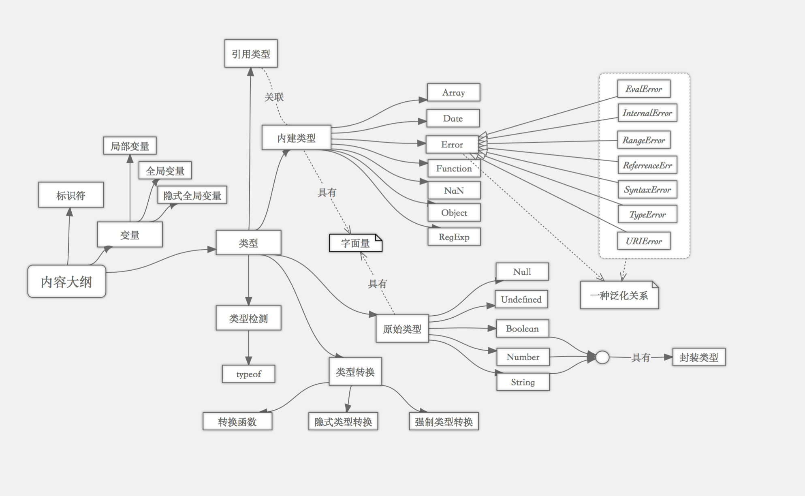

#js基础巩固系列（1）：变量、数据类型与检测

### 前言

> 本系列文章是个人在学习《JavaScript 高级程序设计》第3版时的学习笔记，目的是为了巩固和掌握js的核心知识。所有内容匀不涉及ECMAScript6新增内容。由于本人很少写作，在文字表达上难免有些拗口，有阐述不清晰的地方，希望各位同行批评指正。如果某些知识点有遗漏的地方，也欢迎各位补充。

### 知识结构图



### 标识符

标识符是指变量、函数、属性的名字，或者函数的参数。标识符可以是按照下列格式规则组合起来的一或多个字符：

 - 第一个字符必须是一个字母、下划线( _ )或一个美元符号( $ )；
 - 其他字符可以是字母、美元或者数字。

按照惯例，JavaScript中标识符采用驼峰大小写格式，即每个单词第一个字母小写，剩下的每个单词的首字母大写：

```js
var firstName = 'wu';
function getNameById(id) {
    // do something...
}
```

> 注意：不能将关键字、保留字、true、false和null作为标识符，同时注意ECMAScript是区分大小写的。

### 变量

变量使用关键字var进行声明，如果声明的时候未赋值那么变量将取得默认值undefined。由于在JavaScript中函数是唯一拥有作用域的头等公民，因此在函数中使用var定义的变量将成为变量所在作用域中的局部变量，随后会随着当前作用域的退出而被销毁。同时，如果未使用var定义的变量将成为隐含全局变量，成为宿主全局对象的一个属性，在浏览器器环境下即为window对象的一个属性。

```js
// 浏览器中宿主对象为window
var name = 'jenemy'; // 全局作用域下使用var定义一个变量
alert(window.name == name); // true
alert(window.name); // 'jenemy'

// 定义一个函数，并在函数作用域中定义一个局部变量
function test() {
    var message = 'hi';
}
// 由于函数退出后局部变量会被销毁，所以再次访问message变量时会报错
alert(message); // ReferenceError: message is not defined

// 如果将上面test()函数变量定义时的关键字`var`去掉，再次从外部访问时就不会产生错误
function test() {
    // 全局变量
    message = 'hi';
}
alert(message); // hi
```

 > 注意：在函数中命名参数同样是局部变量，在未被调用时默认取得值undefined。

在编程语言中属性和变量是两个严格区分的概念。属性的定义是根据对象的特征而来的，属性是对变量的一种保护，它可以操作私有变量，而变量的定义是根据特定环境而言的。我们可以对属性进行赋值、取值或者使用delete操作符删除一个属性，而变量只能赋值，它（这里指局部变量）的生命周期也局限在一个作用域内。

由于隐含全局变量实际上是一个宿主对象的属性，因此可以使用delete操作符来删除它。

```js
// 变量
var name = 'jenemy';
delete name; // false

// 隐含全局变量实际上是一个宿主对象的属性
age = 12;
delete age; // true
```

在JavaScript中变量仅仅是一个用于保存值的占位符而已，对变量值的类型没有任何限制。同时对于已赋值的变量，同样可以赋予其新的值，但是通常不建议这样做。

```js
var message = 'hi';
message = 520303; // 有效，但不推荐
```

在为多个相同值的变量赋值时，如果是有使用过其它语言的开发人员会想当然的写出下面的变量赋值语句。殊不知在js中稍不留神其实就创建了一个隐藏很深的隐含全局变量：

```js
function foo() {
    // 由于变量赋值操作是从右至左进行的，首先解析地是b=0，
    // 此时隐式创建了一个全局变量，然后是解析var a = b，结果a为本地变量，b成了全局变量。
    // 等同于 var a = ( b = 0 );
    var a = b = 0;
}

alert(a); // ReferenceError: a is not defined
alert(b); // '0'
```

由于JavaScript没有块级作用域，在for和if语句中定义的变量也可以在语句外部访问到。if语句中的变量声明会将变量添加到当前的执行环境，而for语句只会在循环执行结束后保存变量的值，同样存在于循环外部执行环境中。

```js
// if 语句的变量
if (true) {
    var name = "jenemy";
}

alert(name); // jenemy

// for 语句中的变量
for (var i = 0; i < 10; i++) {
    doSomething();
}

alert(i); // 10
```

注意，变量定义的作用域并不是离其最近的封闭语句和代码块，而是包含它们的函数。JavaScript隐式地提升声明部分到封闭函数的顶部，而将赋值留在原地。

```js
// 变量声明提升示例来源
// 《Effective JavaScript》第十二条：理解变量声明提升
function isWinner(player, others) {
    var highest = 0;
    for (var i = 0, n = others.length; i < n; i++) {
        // 这里重声明了一个已经存在于作用域中的变量，
        // 每次循环都会重写同一变量
        var player = others[i];
        if (player.score > highest) {
            highest = player.score;
        }
    }
    return player.score > highest;
}
```

虽然可以在函数中的任意位置声明多个var语句，并且它们会被自动提升自函数顶部。但是，当你使用了一个变量，然后不久又在函数中重新声明的话，就可能产生逻辑错误。

```js
var name = 'global_name';

function test() {
    alert(name); // undefined
    var name = 'local_name';
    alert(name); // local_name
}
```

在创建多个变量时应当了解的是：完成多个操作的单个语句要比完成单个操作的多个语句快。因此在多个变量定义时最好使用一个语句来定义变量：

```js
// 4个语句，很浪费
var name = 'jenemy';
var age = 24;
var address = 'Shanghai';
var now = new Date();

// 一个语句
var name = 'jenemy',
    age = 24,
    address = 'Shanghai',
    now = new Date();
```

在实际开发过程中应当避免或者少用全局变量，一方面由于在局部作用域中定义的全局变量很难维护，而且如果有意地忽略了var操作符，也会由于相应变量不会马上定义而导致不必要的混乱；另一方面，在查询全局变量时的开销要比查询局部变量的成本要高；最后，当程序的两个不同部分定义同名但不同作用的全局变量的时候，容易命名冲突。

### 数据类型

JavaScript中数据类型分为两种：基本类型和引用类型。基本类型包括Undefined、Null、Boolean、Number和String，每种类型都有其字面量值。引用类型最典型的就是Object类型，它本质上是一种数据结构，由一组无序的名值对组成。

基本类型中除了Undefined和Null外，Boolean、Number和String类型都有对应的封装类型。每当这三种类型之一创建并被读取时，后台就会创建一个对应的基本封装类型对象，从而让我们能够调用一些方法来操作这些数据。

```js
var str1 = "some test here";

// 由于基本类型不是对象，因此不应该有方法。
// 对于Boolean、Number和String类型，后台自动做了一些操作，让其拥有方法
var str2 = str1.substring(2); // 'me test here'
```

引用类型与基本包装类型的主要区别就是对象的生命周期。使用new操作符创建的引用类型的实例，在执行流离开当前作用域前一直保存在内存中。而自动创建的包装类型的对象，则只存在于一行代码的执行瞬间，然后立即被销毁。

```js
// 基本包装类型对象
var str1 = 'some text';
// 和调用 var str1 = String('some text'); 方式结果一样
// 注意直接调用String()的方式实为转型函数，使用new是调用基本包装类型的构造函数
str1.name = 'jenemy';
str1.name; // undefined

// 引用类型
var str2 = new String('some text');
str2.name = 'jenemy';
str2.name; // jenemy
```

#### Undefined类型

Undefined类型只有一个值，即特殊的undefined。上面介绍变量时我们知道变量在声明后但未赋值前默认值就是undefined。其次，在函数参数没有被显示地传递值时默认值为undefined,同时如果该函数没有定义返回值，则return将会隐式返回undefined。如果访问一个不存在的属性也会获得undefined。

```js
// 直接访问未修改的undefined
alert(undefined); // undefined

// 变量声明后未赋值
var name;
alert(name); // undefined

// 函数参数没有显示传递值
function foo(a, b) {
    alert(a + ':' + b);
}
foo(); // undefined:undefined

// 函数没有显示指定return值
function bar() {}
bar(); // undefined

var person = new Object();
person.name = "jenemy";
// 将sex属性值设置为undefined
person.sex = undefined;

// 访问Person不存在的属性值age
alert(person.age); // undefined
alert(person.sex); // undefined

// 其它为undefined的情况
// 来源自stackoverflow
var undefined ; undefined ; // undefined
({}).a ;                    // undefined
[].a ;                      // undefined
''.a ;                      // undefined
(function(){}()) ;          // undefined
void(0) ;                   // undefined
eval() ;                    // undefined
1..a ;                      // undefined
/a/.a ;                     // undefined
(true).a ;                  // undefined
```

由于全局变量undefined只保存了Undefined类型实际值的副本，因此对它赋值不会改变undefined的值：

```js
// undefined为全局变量
alert(window.undefined === undefined); // true

// 改变undefined的值
undefined = 'changed';
alert(undefined); // undefined

// 在全局作用域中为undefined赋值，不会改变undefined的值
var undefined = 'jenemy';
function test() {
    // 这里的undefined值为未改变，仍然是全局变量undefined
    var b = undefined,
        c;
    console.log(b);
    console.log(b == undefined);
    console.log(undefined);
    console.log(b == 'jenemy');
    console.log(c == undefined);
}
test();

/* 结果：
 * ================================
 * undefined
 * true
 * undefined
 * false
 * true
 * ================================
*/
```

然而，为了方便其它变量和undefined做比较，我们需要事先获取类型undefined的值。上面例子中我们试图改变全局作用域中的undefined的值，未能如愿。如果在局部作用域中定义一个变量undefined并赋予一个不等undefined的值，又会如何呢？

```js
function test() {
    // 在函数内部定义一个undefined变量
    var undefined = 'jenemy';
    // 这里赋值给b的实际为内部变量undefined
    var b = undefined,
        c;
    console.log(b);
    console.log(b == undefined);
    console.log(undefined);
    console.log(b == 'jenemy');
    console.log(c == undefined);
}
test();

/* 结果：
 * ================================
 * jenemy
 * true
 * jenemy
 * ture
 * false
 * ================================
*/
```

对比后发现，在局部作用域下对undefined重新赋值后，丢失了原始的undefined值，导致正常情况下与undefined相关操作不符合我们预期的行为。为了避免可能对undefined值的改变，一个常用的技巧是使用一个传递到匿名包装器的额外参数，在调用时这个参数不会获取任何值。

```js
function test() {
    var undefined = 'jenemy';
    // 这里我们访问的是重新赋值后的undefined
    console.log(undefined);
    console.log('========== 分隔线 ==========');
    // 这里用一个匿名函数作为包装器，并立即执行
    (function(undefined) {
        var b = undefined,
        c;
        console.log(b);
        console.log(b == undefined);
        console.log(undefined);
        console.log(b == 'jenemy');
        console.log(c == undefined);
    }) ();
}
test();

/* 结果：
 * ================================
 * jenemy
 * ========== 分隔线 ==========
 * undefined
 * true
 * undefined
 * false
 * true
 * ================================
*/
```

另一种达到同样目的的方法就是在函数内部使用变量声明，这样undefined就会默认被赋值undefined。

```js
function test() {
    var undefined = 'jenemy';
    // 这里我们访问的是重新赋值后的undefined
    console.log(undefined);
    console.log('========== 分隔线 ==========');
    // 这里并没有向函数添加额外的参数
    (function() {
        var undefined,
            b = undefined,
            c;
        console.log(b);
        console.log(b == undefined);
        console.log(undefined);
        console.log(b == 'jenemy');
        console.log(c == undefined);
    }) ();
}
test();

/* 结果：
 * ================================
 * jenemy
 * ========== 分隔线 ==========
 * undefined
 * true
 * undefined
 * false
 * true
 * ================================
*/
```

#### Null类型

Null类型也只有一个数据类型null, null值表示一个空对象的指针，使用typeof操作符检测null值时会返回'object'。

```js
var name = null;
alert(typeof name); // object
```

实际上，undefined值是派生自null值的。尽管null和undefined有这样的关系，但它们的用途完全不同。如果保存对象的变量值还没有真正保存对象，就应该明确地让变量保存null值。

```js
alert(null == undefined); // true
```

##### Boolean类型

Boolean类型是使用得最多的一种类型，该类型只有两个字面值：true和false。

```js
var found = true;
var lost = false;
```

在js中，可以对任何数据类型调用Boolean()函数，而且总会返回一个Boolean值。下面给出了各种数据类型及其对应的转换规则。

| 数据类型      | 转换为true的值             | 转换为false的值    |
| ------------- | -----------------------    | ----------------   |
| Boolean       | true                       | false              |
| String        | 任何非空字符串             | ""或者''(空字符串) |
| Number        | 任何非零数字值(包括无穷大) | 0和NaN             |
| Object        | 任何对象                   | null               |
| Undefined     | n/a                        | undefined          |

> 注意，JavaScript中有7个假值：false、0、-0、""、NaN、null和undefined。其它所有值都为真。

在使用Boolean类型时，注意Boolean()和new Boolean()是有区别的。Boolean类型作为普通函数调用时返回的是原始值：true或者false，而作为构造函数调用时并不会返回原始值，而是返回一个object对象。

```js
var fTrue = Boolean(true),
    fFalse = Boolean(false),
    cTrue = new Boolean(true),
    cFalse = new Boolean(false);

console.log(fTrue);
console.log(fFalse);
console.log(cTrue);
console.log(cFalse);

/* 在chrome下结果：
 * ================================
 * true
 * false
 * Boolean {[[PrimitiveValue]]: true}
 * Boolean {[[PrimitiveValue]]: false}
 * ================================
*/
```

由于在布尔表达式中的所有对象都会被转换为true，因此当Boolean类型作为构造函数调用时，传递给它的参数值不为undefined或者null时，即使传递false作为值也同样返回true

```js
var cFalse = new Boolean(false);

// 输出: "My false Boolean object is truthy!"
if (cFalse) {
    console.log('My false Boolean object is truthy!');
} else {
    console.log('My false Boolean object is falsy!');
}
```

Boolean类型重写了valueOf()方法，返回基本类型值true或false；重写了toString()方法，返回字符串"true"和"false"。因此想要获取Boolean对象的原始值，我们可以使用valueOf()方法返回其基本类型的布尔值表示。

```js
var cFalse = new Boolean(false);

// 输出: "My false Boolean object is falsy!"

// 注意：这里如果换成cFalse.toString()，返回的还是true
if (cFalse.valueOf()) {
    console.log('My false Boolean object is truthy!');
} else {
    console.log('My false Boolean object is falsy!');
}
```

在项目中不建议使用Boolean类型的构造函数，最好将Boolean()作为通过函数调用或者使用两次逻辑非操作符'!'来达到同样目的。
```js
// 下面二种方式都会将0强制转换为false
var byFunction = Boolean(0);
var byNotNot = !!(0);
```

#### Number类型

在ECMAScript中，Number类型使用64位IEEE754格式来表示整数和浮点数值。其中整数可以使用十进制、八进制和十六进制来表示。
```js
// 十进制直接输入
var intNum = 100; // 100

// 八进制第一位必须为0, 后面跟八进制数字(0 ~ 7)
var octalNum1 = 0123; // 83
// 如果字面值超过了八进制数字值范围，那么前导0将被忽略
var octalNum2 = 089; // 89

// 十六进制字面值前两位必需是0x，后跟任何十六进制数字(0 ~ 9 及 A ~ F)
var hexNum = 0xef; //239
```

浮点数的另一种表示法为e表示法（科学表示法）来表示。即数值等于e前面的数值乘以10的指数次幂。在默认情况下，如果小数点后面带有6个零以上，会被自动 转化为以e表示法表示的数值。

```js
var floatNum1 = 1.1; // 1.1
var floatNum2 = 0.1; // 0.1
var floatNum3 = .1; // 0.1 有效，但不推荐
var floatNum4 = 1.; // 小数点后面没有数字--解析为1
var floatNum5 = 10.0; // 整数--解析为10

var floatNum6 = 3.125e7; // 31250000
var floatNum7 = 0.0000007; // 7e-7
```

关于使用浮点数时需要注意的是浮点数在计算时会产生舍入误差的问题，浮点运算只能产生近似的结果，四舍五入到最接近的可表示的实数。

```js
0.1 + 0.2; // 0.30000000000000004
1.2 - 1.1; // 0.09999999999999987
```

> 具体原因请查看本文所列参考文章。

在Number类型中可以用`toFixed()`方法以定点表示法来格式化一个小数，它接受一个参数用于指定格式化后小数点后数字的个数(0< 个数 <= 20)，如果忽略该参数，则默认值为0。

对于`toFixed()`方法返回值，这里直接引用Mozilla关于其描述：

> 一个数值的字符串表现形式，不使用指数记数法，而是在小数点后有 digits 位数字。该数值在必要时进行四舍五入，另外在必要时会用 0 来填充小数部分，以便小数部分有指定的位数。 如果数值大于等于 1e+21，该方法会简单调用 Number.prototype.toString() 并返回一个指数记数法格式的字符串。

```js
var num = 123.456789;

num.toFixed(); // 返回 '123'，进行四舍五入，不包括小数部分
num.toFixed(5); // 返回 '123.45679'，进行四舍五入
num.toFixed(22); // 返回 RangeError: toFixed() argument must be between 0 and 20

75.05.toFixed(1); // 返回 '75.0'
75.06.toFixed(1); // 返回 '75.1'
12.05.toFixed(1); // 返回 '12.1'
12.04.toFixed(1); // 返回 '12.0'

num.toFixed(10); // 返回 '123.4567890000'
num.toFixed(16); // 返回 '123.4567890000000006'

1e+20.toFixed(); // 返回 '100000000000000000000'
1e+21.toFixed(); // 返回 '1e+21'，原值字符串返回
```


对于数值的转换，第一个要了解的就是Number()转换函数，它可以用于任何类型转换成数值

### 书籍参考

 * [JavaScript高级程序设计(第三版)](http://book.douban.com/subject/10546125/)
 * [JavaScript面向对象精要](http://book.douban.com/subject/26352658/)
 * [Effective JavaScript](http://book.douban.com/subject/25786138/)

### 网络参考

 * [detecting-an-undefined-object-property](http://stackoverflow.com/questions/27509/detecting-an-undefined-object-property)
 * [javascript 秘密花园](http://bonsaiden.github.io/JavaScript-Garden/zh/)
 * [MDN Boolean](https://developer.mozilla.org/en-US/docs/Web/JavaScript/Reference/Global_Objects/Boolean)
 * [The Difference Between Boolean Objects and Boolean Primitives in JavaScript](http://adripofjavascript.com/blog/drips/the-difference-between-boolean-objects-and-boolean-primitives-in-javascript.html)
  * [Android计算器低级错误？都是二进制惹的祸！](http://www.guokr.com/article/27173/)
 * [javascript中类型检测](http://www.cnblogs.com/sprying/p/4349426.html)

